# 🔄 Alive5 Voice Agent - Flow Diagrams

## System Architecture Flow

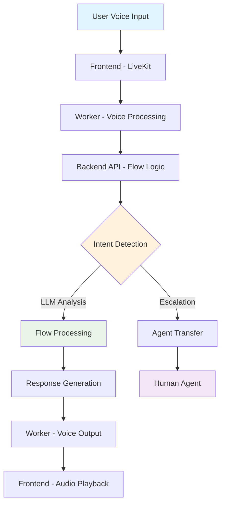

## Intent Detection Flow

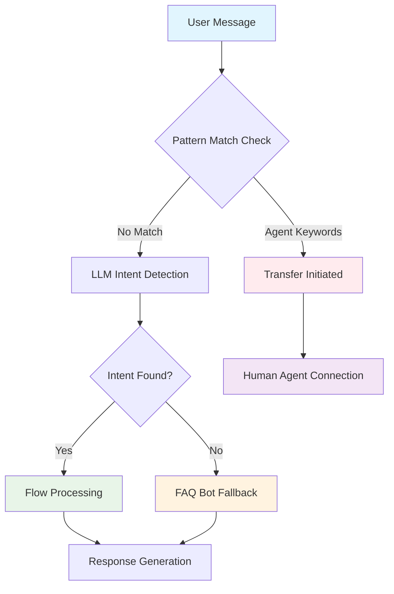

## Conversation Flow Examples

### 1. Agent Transfer Flow

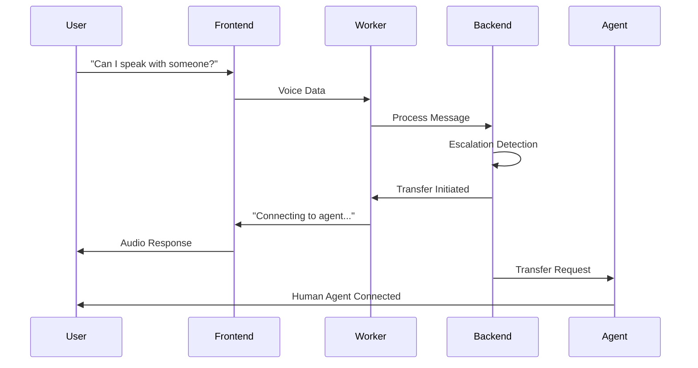

### 2. Pricing Flow

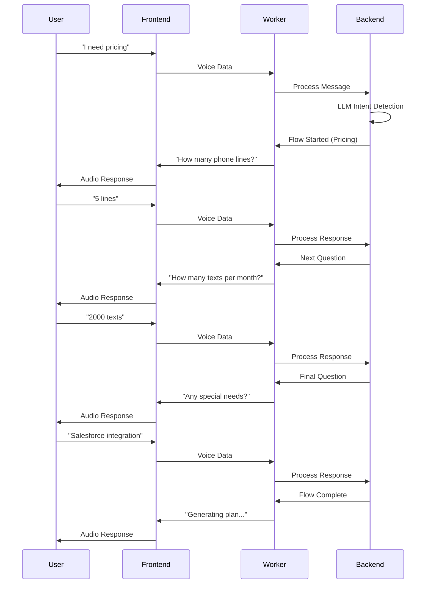

### 3. Weather Flow

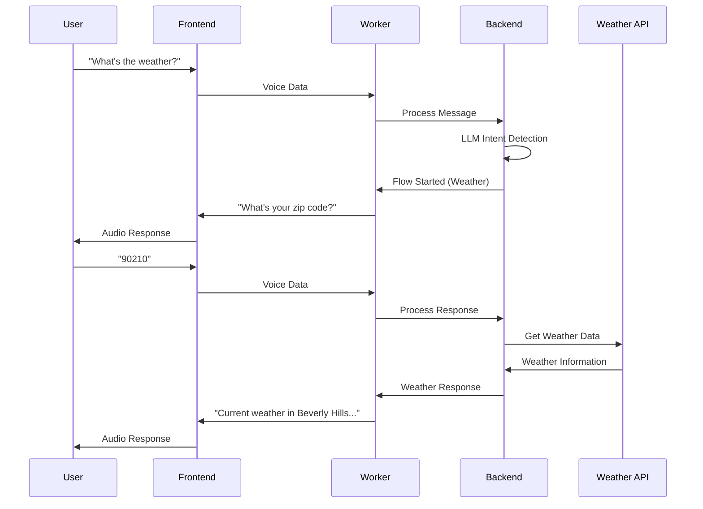

## State Management Flow

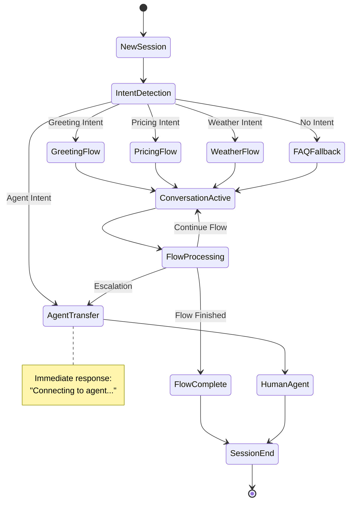

## Error Handling Flow

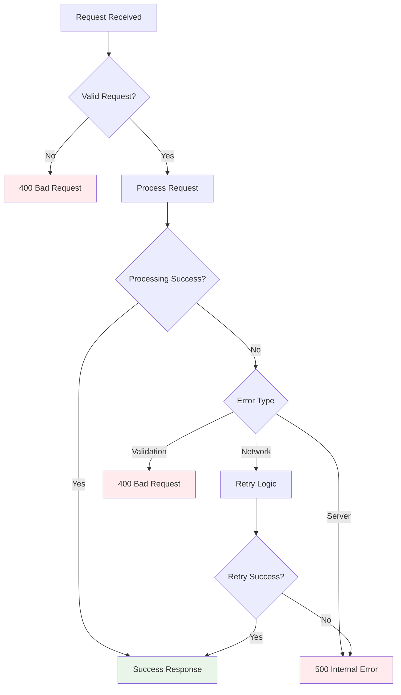

## Deployment Flow

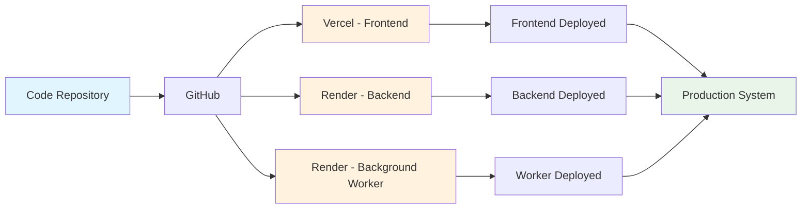

## Data Flow Architecture

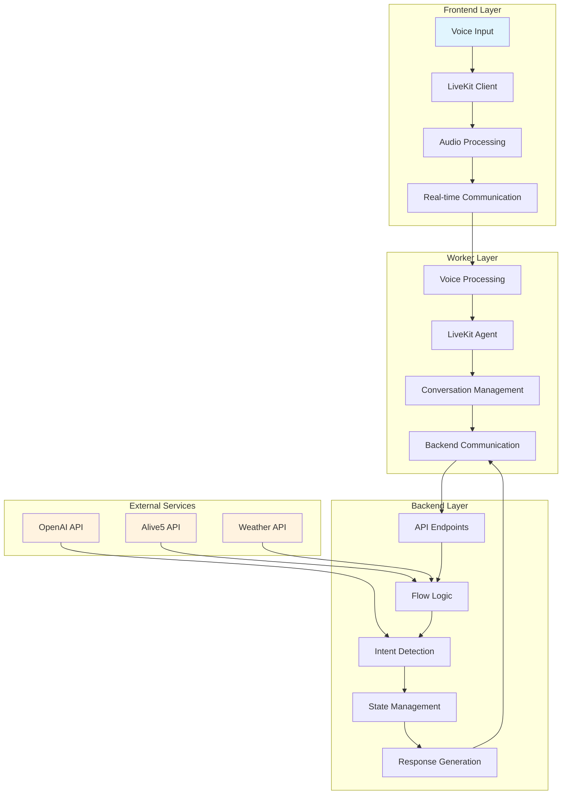

## Performance Monitoring Flow

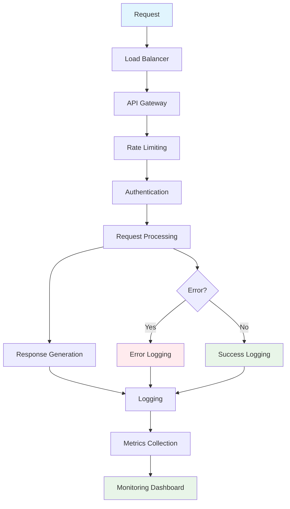

## Security Flow

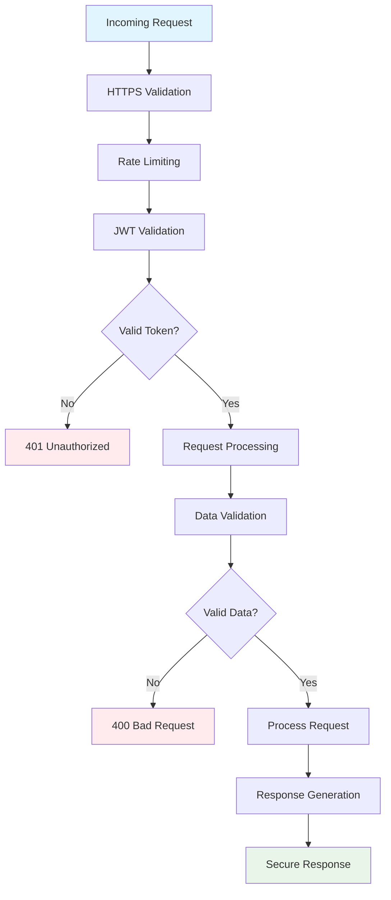

## Session Lifecycle

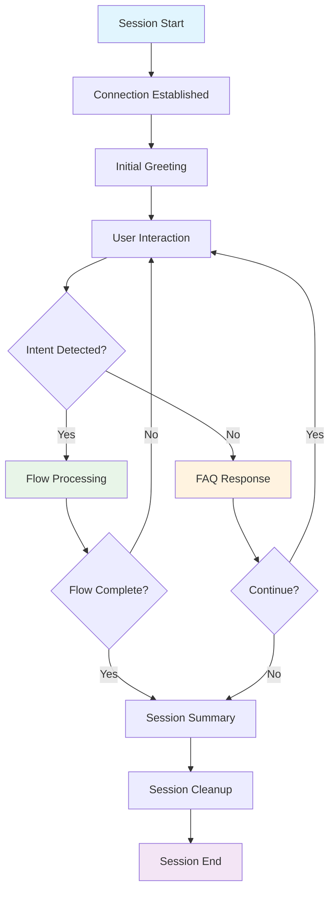

---

These diagrams provide a comprehensive visual representation of how the Alive5 Voice Agent system works, from high-level architecture to detailed conversation flows. They can be used for client presentations, technical documentation, and system understanding.
